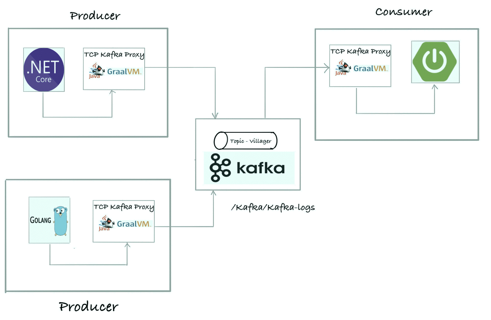
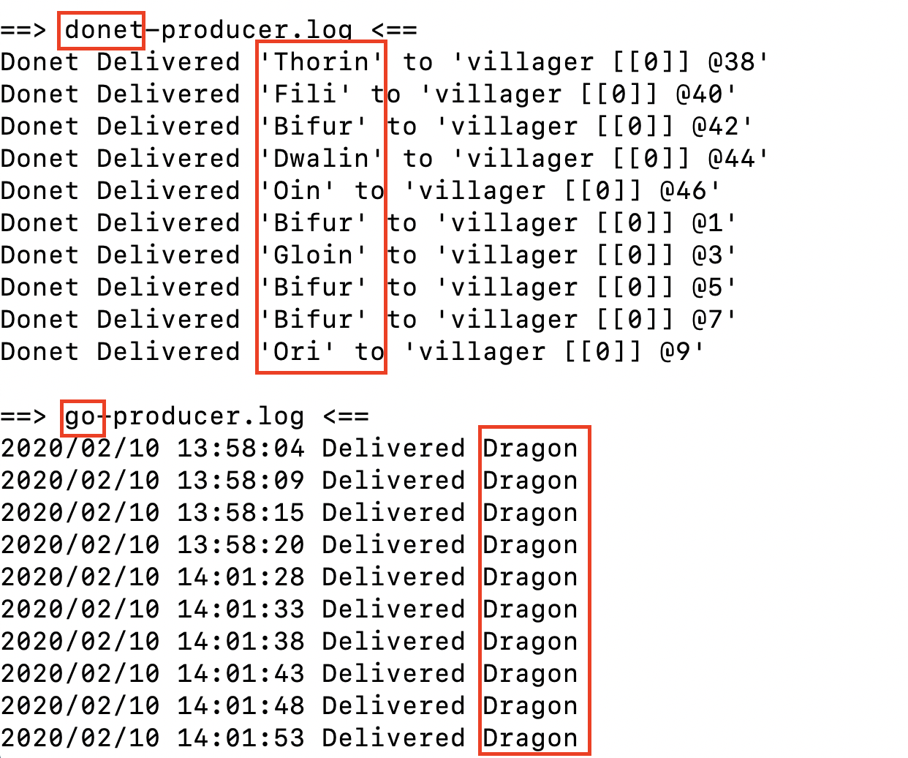
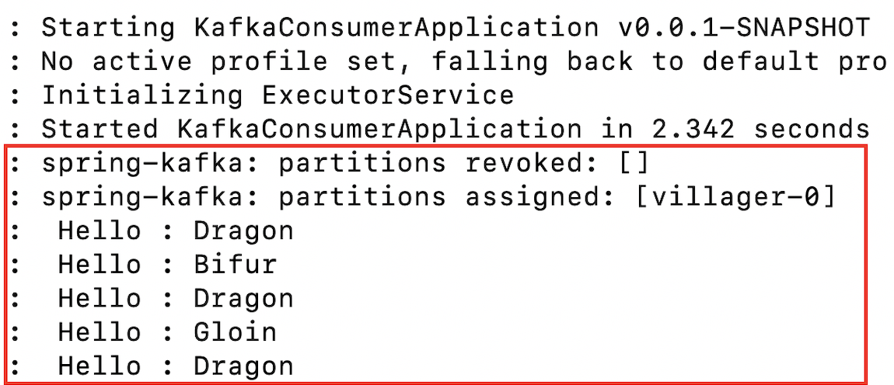
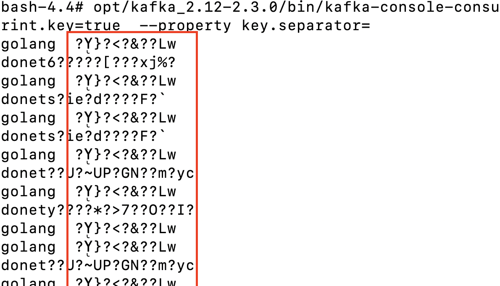
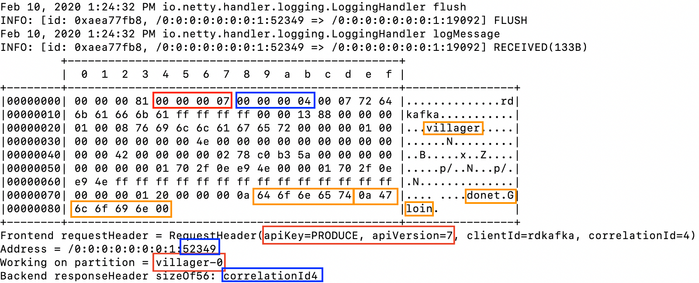

# Kafka Proxy

 <p align='right'>An example of a Kafka Proxy built using netty.  See references below for related work. A <a href="http://www.swisspush.org">swisspush</a> project <a href="http://www.swisspush.org" border=0></a></p>

__User Story__

Two kafka producers (golang and dotnet) are producing messages and a springboot application is 
consuming them. The message content should be encrypted (not the key's) and this should be transparent to all Kafka clients. <br/>


Note : The diagram shows a proxy per Kafka client, in this example all these proxies collapse to one as we reuse it for all clients.  

More notes : https://medium.com/@caoimhin.denais/kafka-proxies-and-service-meshes-8218353dac50 <br/>


__Quickstart__

_Note : adjust JAVA_HOME's accordingly to your local deployment's_ 

1. Start the Kafka broker
    ```
    docker-compose -f broker/docker-compose-single-broker.yml up
    ```

2. Build and run Kafka proxy using __OpenJDK 64-Bit GraalVM CE 19.3.0__ 
    ```
    export JAVA_HOME=$(/usr/libexec/java_home -v 11.0.5) && export PATH=$JAVA_HOME/bin:$PATH
    mvn clean package -f ./kafka-netty-proxy/pom.xml
    ./kafka-netty-proxy/target/io.proxy.kafkaproxy 1>> kafka-proxy.out 2>&1 &
    ```

3. Build and run the Spring boot Kafka consumer using __OpenJDK Runtime Environment AdoptOpenJDK (build 11.0.3+7)__
    ```
    export JAVA_HOME=$(/usr/libexec/java_home -v 11.0.3) && export PATH=$JAVA_HOME/bin:$PATH
    mvn clean install -f ./java-consumer/pom.xml -DskipTests
    java -jar java-consumer/target/java-consumer-0.0.1-SNAPSHOT.jar >> java-consumer.log &
    ```
_Note : Sometimes on startup the consumer throws a "Cannot connect to empty node :19092" simply restart the consumer (or send a pull request :-)) . Afterwards it's fine.  I'm thinking it's some race condition _ 


4. Build and start the producer's
    ```
    cd ./donet-producer/ && dotnet publish && cd ..
    cd ./go-producer/ && go build && cd ..
    
    while sleep 5; do
        ./go-producer/go-producer 1>> go-producer.log 2>&1
    done &
    
    while sleep 2; do
        dotnet run --project donet-producer/ >>  donet-producer.log
    done &
    ```
_Note : In this example if you start the producers to far ahead of the consumer you run into batch problems. I'm not sure if it's related to the AES or an ignored Kafka field, in anycase start the consumer first for now_

__TODO/Ideas__
* Fix two issues noted in quickstart
* Allow more flexibility, give the option of just a transparent proxy (i.e. only logging no encryption)
* Create the yaml to deploy it to Kubernetes, where each Kafka client has it's own sidecar proxy

__Results__

Below we have both the Dotnet and Go logs. Tailing them we see the message values printed in plaintext.


``` tail -f donet-producer.log go-producer.log ```



``` tail -f java-consumer.log ```



The Kafka broker is running on a docker container. Using the docker execcommand we can log directly into a bash terminal. From here (using the kafka console consumer)  messages can be consumed without going through the Kafka proxy. Therefore there is no modification of the Kafka protocol in transient and we can clearly see the message values are encrypted.

```docker exec -it broker_kafka_1 bash /opt/kafka_2.12-2.3.0/bin/kafka-console-consumer.sh --bootstrap-server localhost:9092 --topic villager --group broker-consumer --property print.key=true --property key.spearator="-" ```



Finally taking a glimpse into the the proxy logs we can see Kafka requests and responses flowing by.  In the screenshot below we see a Produce request in transit.

- A Kafka request with an API key of 0, i.e. a Produce request
- The version of the Produce request is 7
- The client is listening on the ephemeral port 52349 and this is the 4th request sent by the client, i.e. the correlation ID is 4
- The destination topic is villager with a key donet* and value of Gloin 


```tail -f Kafka-proxy.out```


__Resources__
 
 There has been some work by different people in the past few year's and this is not an exhaustive list but 
 heres what I've stumbed accross. David Jacot [ [1](https://www.confluent.io/kafka-summit-lon19/handling-gdpr-apache-kafka-comply-freaking-out/) ] gave a really interesting talk at the Bern Streaming Meetup 
 group demoing how you might implement GDPR compliance using Kafka Proxies. Prior to that Travis Jeffery 
 wrote an implementation of Kafka and a Proxy in golang [ [2](https://www.confluent.io/kafka-summit-lon19/handling-gdpr-apache-kafka-comply-freaking-out/) ]. Banzaicloud took a slightly different 
 angle [ [3](https://banzaicloud.com/blog/kafka-envoy-protocol-filter/) ] and  ran a Kafka cluster on Istio. And finally today Adam Kotwasinski is busy implementing a 
 Kafka filter for envoy  [ [4](https://github.com/envoyproxy/envoy/issues/2852) ]
 
 [1] https://www.confluent.io/kafka-summit-lon19/handling-gdpr-apache-kafka-comply-freaking-out/ <br/>
 [2] https://github.com/travisjeffery/kafka-proxy  <br/>
 [3] https://banzaicloud.com/blog/kafka-envoy-protocol-filter/  <br/>
 [4] https://github.com/envoyproxy/envoy/issues/2852
 
 
 __Prerequisites__
 
 [5]: https://dotnet.microsoft.com/download <br/>
 [6]: https://golang.org/doc/install <br/>
 [7]: https://adoptopenjdk.net <br/>
 [8]: https://github.com/graalvm/graalvm-ce-builds/releases 
